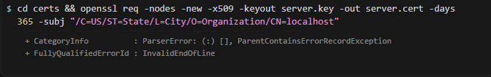

# Lab 3: Implementing SSL/TLS on a Node.js Server

## Overview
This lab demonstrates how to upgrade a basic Node.js HTTP server to use HTTPS with SSL/TLS using a self-signed certificate.

## Files
- `server.js` - Basic HTTP server (starter code)
- `server_https.js` - HTTPS server with SSL/TLS
- `certs/` - Directory containing SSL certificate files
  - `server.key` - Private key
  - `server.cert` - Self-signed certificate

## Setup Instructions

### 1. Generate TLS Certificate

**Option A: Using OpenSSL (if installed)**
```bash
mkdir certs
cd certs
openssl req -nodes -new -x509 -keyout server.key -out server.cert -days 365
```
When prompted, you can use fake information (press Enter for defaults or fill in any values).

**Option B: Using Node.js (Alternative - Works on Windows without OpenSSL)**
```bash
npm install
npm run generate-cert
```
This will generate the certificate files in the `certs/` directory.

### 2. Run HTTP Server (for comparison)
```bash
node server.js
```
Visit: http://localhost:3000

### 3. Run HTTPS Server
```bash
node server_https.js
```
Visit: https://localhost:3443

**Note:** Your browser will show a security warning because the certificate is self-signed. This is expected behavior. Click "Advanced" and "Proceed to localhost" to continue.

### 4. Test with curl

**On Linux/macOS/WSL:**
```bash
# Test with insecure flag (bypasses certificate verification)
curl -k https://localhost:3443

# Test without -k flag (will show certificate verification error)
curl https://localhost:3443
```

**On Windows (PowerShell):**
```powershell
# Run the test script
.\test-server.ps1

# Or manually test (PowerShell 6+)
Invoke-WebRequest -Uri https://localhost:3443 -SkipCertificateCheck

# If you have curl.exe installed
curl.exe -k https://localhost:3443
```

## HTTP vs HTTPS Comparison

| Aspect | HTTP | HTTPS |
|--------|------|-------|
| **Port** | 3000 | 3443 |
| **Protocol** | HTTP | HTTPS (HTTP over TLS/SSL) |
| **Encryption** | None - data transmitted in plain text | Encrypted - data is encrypted in transit |
| **Certificate** | Not required | Requires SSL/TLS certificate |
| **Browser Warning** | None | Shows warning for self-signed certificates |
| **Security** | Vulnerable to eavesdropping, man-in-the-middle attacks | Protects against eavesdropping and tampering |
| **curl Test** | `curl http://localhost:3000` works normally | `curl https://localhost:3443` requires `-k` flag for self-signed certs |

## Why Browser Shows Warning

When you access `https://localhost:3443`, your browser displays a security warning because:

1. **Self-signed Certificate**: The certificate was created locally and is not signed by a trusted Certificate Authority (CA) like Let's Encrypt, DigiCert, etc.
2. **No CA Validation**: Browsers maintain a list of trusted CAs. Since our certificate isn't signed by any of them, the browser cannot verify its authenticity.
3. **Security Feature**: This warning protects users from potentially malicious sites using fake certificates.

For production environments, you would obtain a certificate from a trusted CA. For local development and testing, self-signed certificates are acceptable.

## Deliverables Checklist

- ✅ Modified HTTPS server code (`server_https.js`)
- ✅ Certificate files (`server.cert`, `server.key` in `certs/` directory)
- ✅ Report document (this README + separate report if needed)



